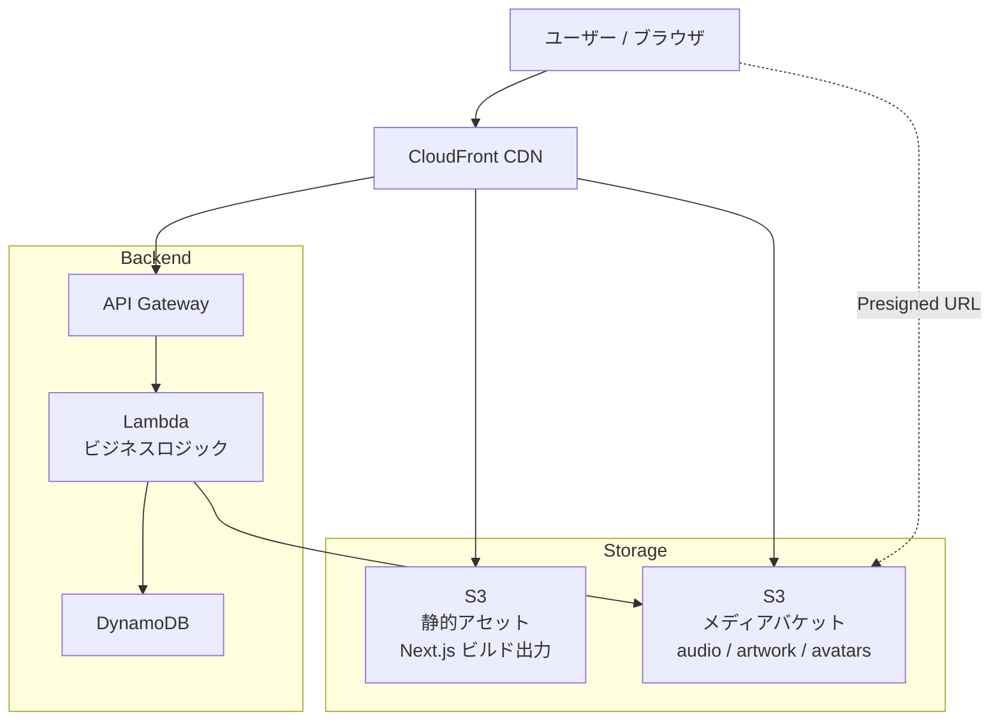
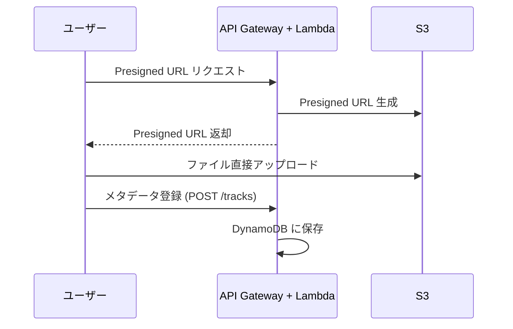
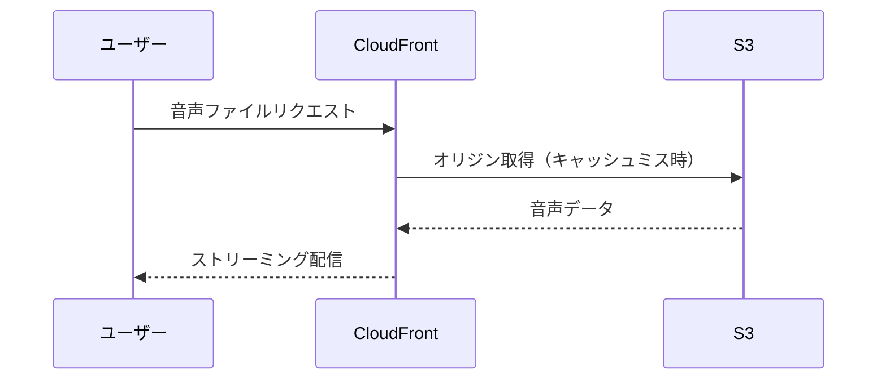

# AI Music Hub - インフラ構成 🏗️

## 全体アーキテクチャ

### アップロードフロー

### 再生フロー

---

## サービス構成

### フロントエンド
| サービス | 用途 |
|---------|------|
| Next.js 14+ (App Router) | SSR/SSG フロントエンド |
| CloudFront | CDN配信 |
| S3 | 静的ホスティング |

### バックエンド
| サービス | 用途 |
|---------|------|
| API Gateway (REST) | APIエンドポイント |
| Lambda | ビジネスロジック |
| DynamoDB | データベース |

### ストレージ（S3）
| バケットパス | 用途 |
|-------------|------|
| `audio/` | 音声ファイル（mp3/wav） |
| `artwork/` | 楽曲アートワーク画像 |
| `avatars/` | ユーザーアバター画像 |

- CloudFront経由で配信
- アップロードはPresigned URLでフロントから直接S3へ（Lambda経由しない）
- 署名付きURLでプレミアム限定ダウンロードの制御が可能

### 認証
| サービス | 用途 |
|---------|------|
| Cognito (or NextAuth) | ユーザー認証・セッション管理 |

- ソーシャルログイン（Google等）対応
- ゲスト視聴OK、投稿にはログイン必須

---

## API設計

| メソッド | エンドポイント | 説明 |
|---------|---------------|------|
| GET | /tracks | 楽曲一覧（フィルター・ソート対応） |
| GET | /tracks/:id | 楽曲詳細 |
| POST | /tracks | 楽曲投稿 |
| DELETE | /tracks/:id | 楽曲削除 |
| GET | /users/:id | ユーザープロフィール |
| GET | /users/:id/likes | いいねした曲一覧 |
| POST | /tracks/:id/like | いいね |
| DELETE | /tracks/:id/like | いいね取り消し |
| GET | /tracks/:id/comments | コメント一覧 |
| POST | /tracks/:id/comments | コメント投稿 |
| POST | /users/:id/follow | フォロー |
| DELETE | /users/:id/follow | フォロー解除 |
| GET | /feed | フォロー中ユーザーの新曲フィード |
| GET | /search | 検索 |
| GET | /playlists/:id | プレイリスト詳細 |
| POST | /playlists | プレイリスト作成 |
| PUT | /playlists/:id | プレイリスト更新（並び替え等） |
| POST | /upload/presigned-url | S3アップロード用Presigned URL取得 |

---

## セキュリティ

- S3バケットは非公開、CloudFront経由のみアクセス許可（OAC）
- API GatewayにCognito Authorizerを設定
- Presigned URLは有効期限付き（アップロード用）
- ファイルサイズ制限（音声: 50MB、画像: 5MB 等）

---

## コスト最適化メモ

- Lambda: リクエスト単位課金、初期はほぼ無料枠内
- DynamoDB: オンデマンドモードで開始、スケール後にプロビジョンド検討
- S3: ストレージ量に応じた従量課金、Intelligent-Tieringも検討
- CloudFront: 無料枠1TB/月、超過分は従量課金
